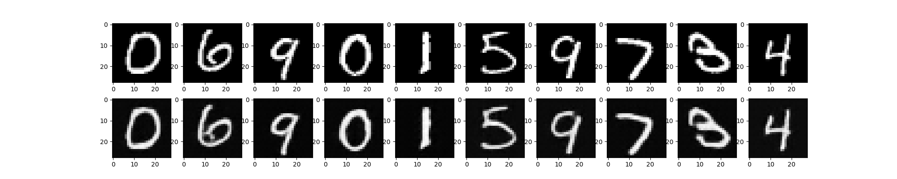
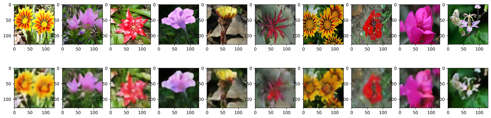

# VQ-VAE Implementation for Image Reconstruction

This repository contains an implementation of the Vector Quantized Variational Autoencoder (VQ-VAE) applied to the reconstruction of MNIST digits and the Oxford Flowers dataset. The VQ-VAE is a powerful generative model that combines elements of both Variational Autoencoders (VAEs) and Vector Quantization. This README provides an overview of the repository, its structure, and instructions for running the experiments.

# TODO

- [ ] Restore `mnist_infer.py`.
- [ ] Finish `pixelcnn`.
- [ ] Use more powerful encoder-decoder architectures.

## Table of Contents

- [Introduction](#introduction)
- [Repository Structure](#repository-structure)
- [Usage](#usage)
- [Results](#results)
- [References](#references)

## Introduction

The Vector Quantized Variational Autoencoder (VQ-VAE) is a generative model that leverages the power of Variational Autoencoders and Vector Quantization. It is particularly effective in learning compact and disentangled representations of input data, making it suitable for tasks like image compression and reconstruction. In this repository, I implement the VQ-VAE and apply it to the reconstruction of two datasets: MNIST digits and the Oxford Flowers dataset.

## Repository Structure

The repository is structured as follows:

- `data/`: This directory contains formatted dataset (only Oxford Flowers , **empty!**).

- `checkpoints/`: This directory contains saved model checkpoints for the VQ-VAE models.

- `results/`: Plots of the reconstructed images.

## Usage

### Requirements

To run the code in this repository, you need to have the following dependencies installed:

- Tensorflow (version 2)
- Keras
- Matplotlib

### Training

1. **Dataset Preparation:** Before training, you need to prepare the datasets.

2. **Training:** Run the training scripts for both MNIST and Oxford Flowers datasets using the following commands:

   ```bash
   python train_mnist.py
   python train_flowers.py
   ```

   This will train the VQ-VAE models using the specified encoder-decoder architectures.

### Evaluation

1. **Reconstruction:** After training, you can evaluate the model's reconstruction capabilities by running the evaluation scripts in the `experiments/` directory:

   ```bash
   python mnist_infer.py
   python flowers_infer.py
   ```

   The reconstructed images will be saved in the `reconstructions/` directory.

## Results

The results of the experiments, including saved model checkpoints, reconstructed images, and evaluation metrics, will be saved in the `reconstructions/` directory. You can use these results to analyze the performance of the VQ-VAE models on the MNIST and Oxford Flowers datasets.

1. **MNIST:** The following figure shows the reconstructed MNIST digits using the VQ-VAE model.

   

2. **Oxford Flowers:** The following figure shows the reconstructed Oxford Flowers images using the VQ-VAE model.

   

## References

- VQ-VAE: https://arxiv.org/abs/1711.00937
- Keras VQ-VAE Tutorial: https://keras.io/examples/generative/vq_vae/